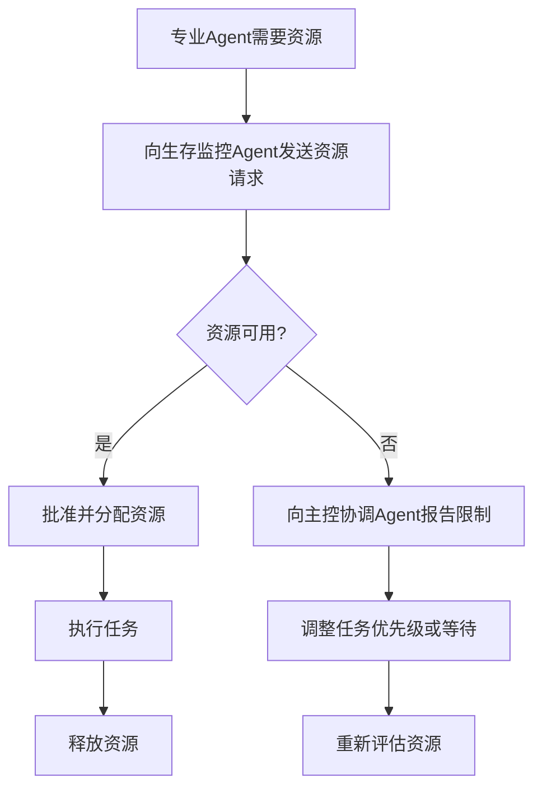

# 🦞 Agent间通信协议

## 协议版本
- **版本**: 1.0
- **生效日期**: 2026-03-10
- **适用范围**: 所有小龙虾Agent

## 通信架构

### 层级结构
```
主人王平
    ↓
实时响应Agent (Assistant-RealTime) ← 快速响应通道
    ↓
主控协调Agent (Coordinator-Main) ← 任务分发中心
    ├── 生存监控Agent (Survival-Monitor) ← 资源/成本控制
    ├── 研究分析Agent (Research-Analyst) ← 研究任务执行  
    └── 执行Agent (待创建) ← 技术实现
```

### 通信路径规则
1. **主人指令** → 实时响应Agent（优先路径）
2. **复杂任务** → 实时响应Agent → 主控协调Agent → 专业Agent
3. **紧急情况** → 任何Agent可直接通知主人（通过实时响应Agent）
4. **资源请求** → 专业Agent → 生存监控Agent → 主控协调Agent
5. **状态报告** → 所有Agent → 主控协调Agent → 汇总报告 → 主人

## 消息格式标准

### 基础消息格式
```json
{
  "message_id": "uuid_v4",
  "timestamp": "ISO8601",
  "sender": "agent_name",
  "recipient": "agent_name|all|master",
  "priority": "immediate|high|normal|low",
  "message_type": "task|response|alert|report|request",
  "content": {
    "task_id": "optional",
    "action": "describe_action",
    "parameters": {},
    "deadline": "optional",
    "resources_needed": {}
  },
  "requires_response": true|false,
  "response_deadline_seconds": 300
}
```

### 优先级定义
- **immediate** (立即): 生存威胁、硬件故障、预算超支
- **high** (高): 主人紧急需求、研究突破、收入机会
- **normal** (正常): 常规任务、日常报告、资源请求
- **low** (低): 信息分享、状态更新、优化建议

## 任务分发协议

### 任务分类矩阵
| 任务类型 | 接收Agent | 处理Agent | 响应时间 |
|---------|-----------|-----------|----------|
| 日常问答 | 实时响应Agent | 实时响应Agent | <5秒 |
| 技术问题 | 实时响应Agent | 主控协调Agent → 执行Agent | <30秒 |
| 研究请求 | 实时响应Agent | 主控协调Agent → 研究分析Agent | <60秒 |
| 资源申请 | 任何Agent | 生存监控Agent | <10秒 |
| 状态查询 | 任何Agent | 主控协调Agent | <5秒 |
| 紧急警报 | 任何Agent | 所有Agent + 主人 | 立即 |

### 任务处理流程
1. **接收任务** → 验证格式和权限
2. **分类路由** → 根据任务类型选择处理Agent
3. **资源检查** → 咨询生存监控Agent资源可用性
4. **执行分配** → 分配给专业Agent执行
5. **进度监控** → 主控协调Agent跟踪进度
6. **结果返回** → 通过原路径返回结果
7. **记录归档** → 任务日志保存

## 资源管理协议

### 资源请求流程


### 资源类型
1. **计算资源**: CPU、内存、存储
2. **API资源**: Token配额、API调用次数
3. **时间资源**: 处理时间、响应时间
4. **财务资源**: 预算分配、成本控制

## 警报和通知协议

### 警报级别
- **红色警报**: 生存威胁，立即通知所有Agent和主人
- **橙色警报**: 严重问题，通知相关Agent和主控协调Agent
- **黄色警报**: 警告信息，记录并监控
- **蓝色警报**: 信息通知，记录供参考

### 通知渠道
1. **内部通信**: Agent间直接消息
2. **状态面板**: 集中状态显示
3. **主人通知**: 通过实时响应Agent转达
4. **日志系统**: 所有通信记录存档

## 冲突解决协议

### 冲突类型
1. **资源冲突**: 多个Agent竞争同一资源
2. **任务冲突**: 任务优先级或执行顺序冲突
3. **结果冲突**: 不同Agent产生矛盾结果
4. **权限冲突**: 访问权限或操作权限冲突

### 解决机制
1. **协商解决**: 相关Agent直接协商
2. **协调仲裁**: 主控协调Agent仲裁
3. **优先级规则**: 按三层优先级系统决定
4. **主人裁决**: 无法解决时提交主人决定

## 性能监控协议

### 监控指标
1. **响应时间**: 消息发送到接收的时间
2. **处理时间**: 任务开始到完成的时间
3. **成功率**: 任务成功完成的比例
4. **资源效率**: 资源使用与产出的比例
5. **通信质量**: 消息丢失或错误的比例

### 优化机制
1. **定期评估**: 每周评估通信效率
2. **瓶颈识别**: 识别并解决通信瓶颈
3. **协议更新**: 根据评估结果更新协议
4. **性能报告**: 生成通信性能报告

## 安全协议

### 安全要求
1. **身份验证**: 所有消息必须包含有效Agent身份
2. **权限检查**: 操作前检查Agent权限
3. **数据加密**: 敏感数据加密传输
4. **审计日志**: 所有通信记录审计日志
5. **异常检测**: 监控异常通信模式

### 安全措施
1. **消息签名**: 重要消息数字签名
2. **访问控制**: 基于角色的访问控制
3. **流量监控**: 实时监控通信流量
4. **入侵检测**: 检测异常访问模式
5. **应急响应**: 安全事件应急响应流程

## 实施时间表

### 第一阶段（本周）
- [ ] 所有Agent实现基础消息格式
- [ ] 建立主控协调Agent路由机制
- [ ] 配置生存监控Agent资源管理
- [ ] 测试基本通信流程

### 第二阶段（下周）
- [ ] 实现任务分发系统
- [ ] 建立警报和通知系统
- [ ] 配置性能监控
- [ ] 测试复杂任务流程

### 第三阶段（下月）
- [ ] 优化通信效率
- [ ] 实现安全协议
- [ ] 建立冲突解决机制
- [ ] 全面部署和验证

## 附录

### Agent通信地址
- **实时响应Agent**: `assistant-realtime`
- **主控协调Agent**: `coordinator-main`
- **生存监控Agent**: `survival-monitor`
- **研究分析Agent**: `research-analyst`
- **执行Agent**: `executor` (待创建)
- **主人**: `master-wangping`

### 紧急联系人
- **技术问题**: 主控协调Agent
- **资源问题**: 生存监控Agent
- **研究问题**: 研究分析Agent
- **响应问题**: 实时响应Agent
- **所有问题**: 主人王平

---

**协议目标**: 确保所有Agent高效、安全、协同工作，实现小龙虾的三层优先级使命。

*最后更新: 2026-03-10*
*版本: 1.0*